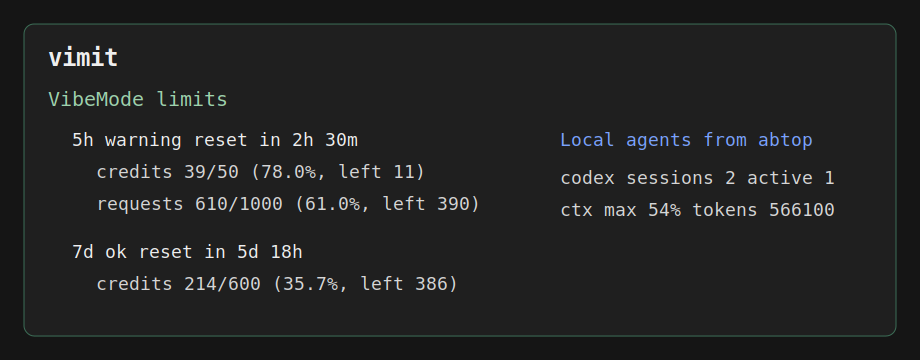

# neurogate-limit-watch

[English](README.md) | [Русский](README.ru.md)

[](https://github.com/xodapi/neurogate-limit-watch/actions/workflows/ci.yml)

**nglimit** — один нативный бинарник для мониторинга лимитов NeuroGate в реальном времени.

Опрашивает `GET /v1/me`, показывает расход credit/request по окнам (5ч / 24ч / 7д / 30д),
рисует live TUI-дашборд (или JSON / compact), отправляет desktop-уведомления при
достижении порогов, поддерживает несколько аккаунтов NeuroGate.

Не нужны Python, Node или SDK — только один исполняемый файл.



## Быстрый старт

```bash
# Скачайте из релизов, затем:
nglimit --demo                # попробовать без API-ключа
nglimit --demo --monitor      # полноэкранный дашборд
nglimit --init                # интерактивный мастер настройки
nglimit                       # реальные лимиты NeuroGate
nglimit --doctor              # диагностика системы
```

## Зачем

Пользователю NeuroGate полезно заранее понимать, можно ли спокойно продолжать
сессию Codex/Droid/Claude/Cursor или лимиты уже близко. Проект маленький,
локальный и не хранит API-ключи, промпты или приватные сообщения.

## Возможности

- **Несколько режимов вывода**: human, JSON (`--json`), compact одной строкой (`--compact`)
- **Live TUI-монитор** (`--monitor`): ratatui-дашборд с индикаторами, sparkline, цветовыми темами
- **Пресеты монитора**: `full` (сетка 2 колонки), `compact` (одна колонка), `mini` (одна строка)
- **12 цветовых тем**: btop, dracula, catppuccin, tokyo-night, gruvbox, nord, high-contrast, protanopia, deuteranopia, tritanopia, solarized, monokai
- **Несколько аккаунтов**: `accounts.toml`, переключение по Tab в TUI, выпадающий список в GUI
- **Desktop-уведомления** (`--notify`): оповещение при warning/danger, без повторов
- **Свои пороги** (`--warning`, `--danger`, `--threshold`): для каждого окна отдельно
- **CI-интеграция** (`--fail-on`): ненулевой exit code при превышении порога
- **Watch mode** (`--watch N`): периодический опрос каждые N секунд
- **abtop-интеграция** (`--with-abtop`): статус локальных Codex/Claude-агентов
- **Диагностика** (`--doctor`): проверка конфига, аккаунтов, env, API
- **Мастер установки** (`--init`): интерактивное создание конфига, .env и API-ключа
- **30-дневные тренды** (`--trend`): история использования в redb, sparklines в TUI
- **GUI** (`--features gui`): desktop-окно на Slint (опционально)
- **Безопасно**: API-ключ только из env, не логируется, нет телеметрии

## Диагностика

Проверка здоровья системы:

```bash
nglimit --doctor
```

Пример вывода:

```
nglimit doctor — system diagnostics

  [✓] config.toml found: /home/user/.config/nglimit/config.toml
  [✓] config.toml is valid TOML
  [✓] accounts.toml: 2 account(s): dev, prod

  environment:
       HOME: /home/user
       NEUROGATE_API_BASE: (not set, will use default)
       NEUROGATE_API_KEY: (set)

  testing API connection to https://api.neurogate.space... OK (4 window(s))

  status: all checks passed
```

## Интерактивная настройка

```bash
nglimit --init
```

Создаёт директорию конфига, `config.toml` с умолчаниями, опционально `.env`
с API-ключом, тестирует соединение.

## Скачать

Бинарные релизы:

https://github.com/xodapi/neurogate-limit-watch/releases

Скачайте архив под свою платформу, распакуйте и запустите:

```bash
nglimit --version
nglimit --demo
nglimit --demo --monitor
```

Windows PowerShell:

```powershell
.\nglimit.exe --version
.\nglimit.exe --demo
.\nglimit.exe --demo --monitor
```

Если запустить `nglimit.exe` двойным кликом из Explorer, Windows-консоль
останется открытой после завершения команды. В Windows-архив также входит
`nglimit-open.cmd` (helper для двойного клика с паузой) и
`nglimit-monitor.cmd` для прямого запуска live-monitor.

## .env рядом с бинарником

Ключ NeuroGate можно держать в локальном `.env` рядом с `nglimit` или в
директории, из которой вы запускаете команду. В релизный архив входит
`.env.example`.

```bash
cp .env.example .env
```

Отредактируйте `.env`:

```dotenv
NEUROGATE_API_KEY=YOUR_NEUROGATE_API_KEY
NEUROGATE_API_BASE=https://api.neurogate.space
```

После этого:

```bash
nglimit
nglimit --compact
nglimit --json
```

Windows PowerShell:

```powershell
Copy-Item .env.example .env
notepad .env
.\nglimit.exe --compact
```

Порядок поиска:

1. `--env-file <PATH>`
2. `.env` в текущей директории
3. `.env` рядом с исполняемым файлом `nglimit`

Настоящие переменные окружения имеют приоритет над значениями из `.env`.

## Сборка из исходников

Требуется Rust stable.

```bash
git clone https://github.com/xodapi/neurogate-limit-watch.git
cd neurogate-limit-watch
cargo build --release --locked
```

Где будет бинарник:

- Windows: `target/release/nglimit.exe`
- Linux/macOS: `target/release/nglimit`

## Использование

Проверить без ключа и без сети:

```bash
nglimit --demo
nglimit --demo --json
```

С реальным ключом NeuroGate:

```bash
export NEUROGATE_API_KEY="YOUR_NEUROGATE_API_KEY"
nglimit
nglimit --json
nglimit --with-abtop
```

Windows PowerShell:

```powershell
$env:NEUROGATE_API_KEY = "YOUR_NEUROGATE_API_KEY"
.\nglimit.exe
.\nglimit.exe --json
```

Mock режим (сохранённый payload):

```bash
nglimit --mock tests/fixtures/me.json
nglimit --mock tests/fixtures/me.json --json
```

Watch mode:

```bash
nglimit --watch 60 --with-abtop
nglimit --watch 60 --notify
```

Live-monitor:

```bash
nglimit --monitor
nglimit --monitor --watch 10
nglimit --monitor --with-abtop
nglimit --monitor --notify
```

Пресеты монитора:

```bash
nglimit --monitor --preset full      # 2 колонки, sparklines (по умолчанию)
nglimit --monitor --preset compact   # 1 колонка, индикатор + метрики
nglimit --monitor --preset mini      # одна строка на окно
```

Управление в TUI: `q`/`Esc` выход, `r` обновить, `?` помощь, `1`-`6` панели,
`Tab` переключение аккаунтов (если несколько).

Пер-оконные пороги:

```bash
nglimit --monitor --threshold 5h=80:95,7d=90
nglimit --fail-on warning --threshold 24h=85:98
```

Desktop-уведомления:

```bash
nglimit --notify
nglimit --watch 60 --notify
nglimit --monitor --notify
```

CI-интеграция:

```bash
nglimit --fail-on warning
nglimit --fail-on danger --json
nglimit --warning 80 --danger 95 --fail-on warning
```

30-дневные тренды:

```bash
nglimit --trend
nglimit --trend --json
nglimit --trend --days 7
nglimit --monitor          # нажмите 5 для sparklines трендов
```

## Вывод

Человекочитаемый вывод с ANSI-цветами:

```text
NeuroGate limits
  5h   warning reset in 2h 30m  peak 78%
       credits  39/50 (78.0%, left 11)
       requests 610/1000 (61.0%, left 390)
```

JSON:

```json
{
  "source": "neurogate",
  "windows": [
    {
      "window": "5h",
      "level": "warning",
      "credits": { "used": 39.0, "limit": 50.0, "remaining": 11.0, "percent": 78.0 }
    }
  ],
  "abtop": null
}
```

## Тренды

```bash
nglimit --trend
```

Показывает ежедневную статистику по окнам за последние 30 дней:
пик max/avg, средний расход credits/requests. Данные хранятся в
`~/.config/nglimit/trends.redb` (redb — встраиваемая ACID-БД, pure Rust).

## Безопасность

- API-ключ читается только из переменной окружения `NEUROGATE_API_KEY`.
- Ключ не записывается на диск.
- Ошибки не печатают ключ.
- JSON-вывод не содержит identity-поля аккаунта.
- `--with-abtop` использует `abtop --status-json`: компактный privacy-safe
  payload без локальных путей, промптов, текста чатов и session ID.
- `--monitor` не выводит API-ключ в терминал.
- `--notify` передает только краткую сводку лимита локальному helper-у ОС.
- Нет телеметрии и внешних сетевых запросов, кроме NeuroGate `/v1/me`.

## Настройка

Переменные окружения:

- `NEUROGATE_API_KEY`: API-ключ NeuroGate.
- `NEUROGATE_API_BASE`: API base URL, по умолчанию `https://api.neurogate.space`.
- `ABTOP_BIN`: путь к бинарнику abtop, по умолчанию `abtop`.

CLI:

```bash
nglimit --help
```

## Обсуждения

Идеи, предложения и заметки по NeuroGate/Codex/Droid workflow можно оставлять
в GitHub Discussions:

https://github.com/xodapi/neurogate-limit-watch/discussions

Текущий список улучшений: [ROADMAP.md](ROADMAP.md).

## Поддерживаемые ОС

- Windows (x86_64)
- macOS (aarch64)
- Linux (x86_64, aarch64)
- Android/Termux — см. [docs/termux.md](docs/termux.md)

## Тесты

```bash
cargo test --locked
cargo clippy --all-targets -- -D warnings
cargo fmt --check
cargo run --locked -- --demo --json
```

## Что работает

- Нативный Rust CLI и GUI (`--features gui`).
- NeuroGate `/v1/me` с устойчивостью к разным схемам ответа.
- Окна 5h / 24h / 7d / 30d credit и request.
- Human, JSON, compact вывод с ANSI-цветами.
- Full-screen ratatui monitor с индикаторами, sparklines, цветовыми темами.
- Пресеты `full`, `compact`, `mini`.
- 12 цветовых тем, включая для accessibility.
- Пер-оконные пороги `--threshold`.
- `.env` файл рядом с бинарником.
- Desktop-уведомления с отслеживанием эскалации.
- Несколько аккаунтов (`accounts.toml`, Tab в TUI, dropdown в GUI).
- Demo/mock без ключа.
- `--doctor` диагностика.
- `--init` мастер установки.
- `--trend` 30-дневные тренды (redb).
- Интеграция с abtop.
- CI и release workflow для Windows, Linux, macOS, ARM.
- PowerShell скрипты установки/удаления.
- Инструкция для Termux/Android.
