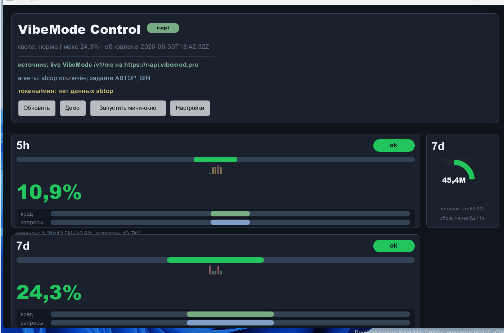

# Конкурсная заявка: vimit

## Название:

**vimit** - безопасный локальный монитор лимитов VibeMode / VibeMod.PRO для вайбкодеров.

## Что делает:

`vimit` показывает расход, остаток и риск достижения лимитов VibeMode по данным `GET /v1/me`.

Основные режимы:

- CLI для быстрой проверки лимитов и скриптов.
- TUI-dashboard в терминале для постоянного мониторинга.
- Slint GUI с карточками лимитов, настройками, tray-индикатором и setup-подсказками.
- Floating overlay поверх рабочих окон с compact/full режимом, drag/resize, pin, переключением `кред/мин`, `ток/мин`, `%/час`.
- Living creature overlay: визуальная форма расхода, skins `шипы` и `органика`, цвет по уровню риска, звуки при смене уровня.
- Desktop notifications для warning/danger/recovery.
- Demo/mock режимы без API-ключа.
- `doctor` и `init` для диагностики и первичной настройки.

Задача проекта: пользователь видит лимиты заранее во время работы в Droid, Codex, Claude Code, Cursor и других AI-инструментах, а не узнаёт о проблеме после отказа API.

## Для кого полезно:

- Пользователям VibeMode / VibeMod.PRO, которые активно работают через API.
- Вайбкодерам, которые держат открытыми AI-инструменты и хотят видеть лимиты рядом с рабочим окном.
- Тем, кому нужен локальный монитор без отправки API-ключей в сторонние сервисы.
- Тем, кто хочет быстро диагностировать `.env`, endpoint, account config и сетевые ошибки.

## GitHub:

https://github.com/xodapi/vimit

## Как запустить:

### Быстрый запуск без ключа

```powershell
git clone https://github.com/xodapi/vimit.git
cd vimit
cargo build --release --features gui --locked
.\target\release\vimit.exe --demo
.\target\release\vimit.exe --monitor --demo
.\target\release\vimit-gui.exe --demo
.\target\release\vimit-gui.exe --demo --overlay
```

### Live-режим с реальными лимитами

Создать `.env` рядом с бинарником или в папке конфига:

```powershell
VIBEMODE_API_KEY=<your-api-key>
VIBEMODE_API_BASE=https://r-api.vibemod.pro
```

Затем:

```powershell
.\target\release\vimit.exe doctor
.\target\release\vimit.exe
.\target\release\vimit-gui.exe
```

Для первичной настройки:

```powershell
.\target\release\vimit.exe --init
```

## Какие ОС поддерживаются:

- Windows x86_64.
- Linux x86_64 / aarch64.
- macOS aarch64.

CI проверяет Windows, Linux и macOS. GUI построен на Slint, TUI построен на ratatui.

## Что уже работает:

- Polling `GET /v1/me` и разбор окон 5h, 24h, 7d, 30d.
- Расчёт used, limit, remaining, percent, reset countdown и уровней `ok` / `warning` / `danger`.
- CLI human / compact / JSON.
- TUI-monitor с темами, compact/full/mini preset и history sparkline.
- GUI-dashboard с карточками лимитов, weekly donut chart, настройками и beginner setup flow.
- Tray icon/tooltip, синхронизированные с текущим dashboard state.
- Floating overlay поверх окон: запуск из GUI, drag, resize, compact/full переключение, pin, native resize без чёрного фонового окна.
- Сглаженный `кред/мин` по 5-минутному окну, чтобы не было скачков `0 -> 10000` от одного poll.
- Living creature overlay: skins `шипы` и `органика`, динамическое число точек, цвет по риску, Windows-звуки при смене уровня без запуска PowerShell/cmd.
- Windows GUI subsystem для `vimit-gui.exe`, без фонового console window.
- Demo/mock режимы для презентации без реального ключа.
- Desktop notifications и recovery notifications.
- Cache fallback без раскрытия API-ключа в cache key.
- Trends database `trends.redb` для накопления исторических snapshots.
- `vimit doctor`, `vimit --init`, account config.
- Совместимость с актуальными `VIBEMODE_*` переменными и legacy fallback для `NEUROGATE_*` без warning spam.
- Тесты и проверки: `cargo fmt --check`, `cargo test --locked`, `cargo test --locked --features gui`, `cargo clippy --all-targets -- -D warnings`, `cargo clippy --all-targets --features gui -- -D warnings`, `cargo build --release --features gui --locked`.

## Что ещё не готово:

- Tagged GitHub Release и архивы с бинарниками нужно создать отдельным ручным релизным шагом после финального approve.
- Полноценные Slint interaction tests через публичный `slint::testing::*` пока не добавлены, потому что в текущей версии Slint публичный testing API/backend не используется проектом.
- Форма creature будет дорабатываться после конкурса: рост от фактического token/credit spend за день, более сложная органика, отдельные настройки skins/sound.
- Звуки сейчас реализованы через Windows `Beep`; на Linux/macOS это no-op до добавления кроссплатформенного audio backend.

## Скрин/видео:

Demo GIF приложен в репозитории:

`docs/vmit_demo_scren.gif`

Markdown-ссылка:



## Готовый текст для отправки в ветку конкурса

Название: vimit

Что делает: локально показывает лимиты VibeMode / VibeMod.PRO из `GET /v1/me`: CLI, TUI, GUI, tray, desktop notifications и floating overlay поверх окон с расходом, reset countdown и living creature визуализацией.

Для кого полезно: для вайбкодеров, которые работают через VibeMode API в Droid, Codex, Claude Code, Cursor и хотят заранее видеть расход и риск достижения лимитов.

GitHub: https://github.com/xodapi/vimit

Как запустить:

```powershell
git clone https://github.com/xodapi/vimit.git
cd vimit
cargo build --release --features gui --locked
.\target\release\vimit.exe --demo
.\target\release\vimit.exe --monitor --demo
.\target\release\vimit-gui.exe --demo
.\target\release\vimit-gui.exe --demo --overlay
```

Live-режим: создать `.env` с `VIBEMODE_API_KEY`, затем запустить `vimit doctor` и `vimit-gui`.

Какие ОС поддерживаются: Windows x86_64, Linux x86_64/aarch64, macOS aarch64.

Что уже работает: polling `GET /v1/me`, проценты по 5h/24h/7d/30d, reset countdown, CLI/TUI/GUI, tray, draggable/resizable overlay, compact/full overlay, creature skins, sounds on level changes, setup/doctor, demo/mock, cache/trends, тесты и CI.

Что ещё не готово: tagged GitHub Release с архивами, кроссплатформенный audio backend, расширенные Slint interaction tests.

Скрин/видео: `docs/vmit_demo_scren.gif`
