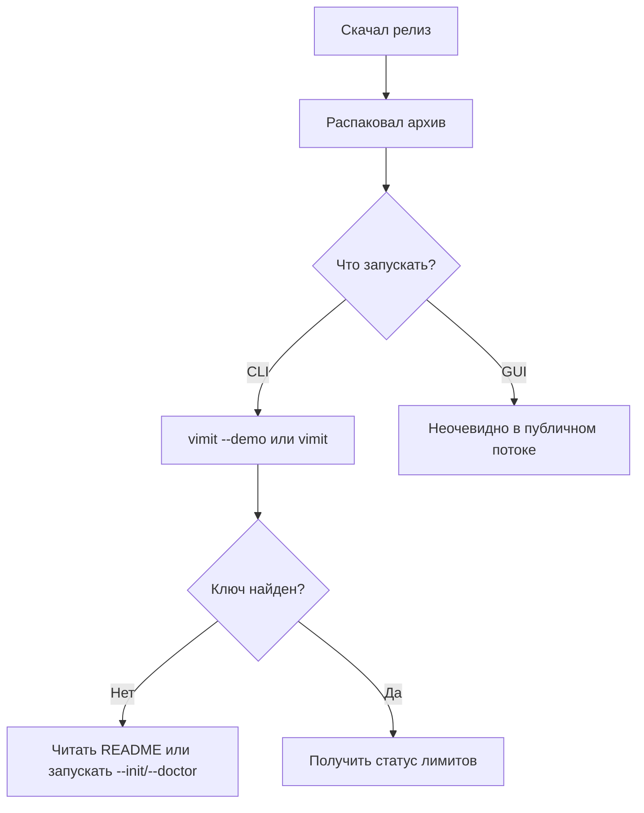
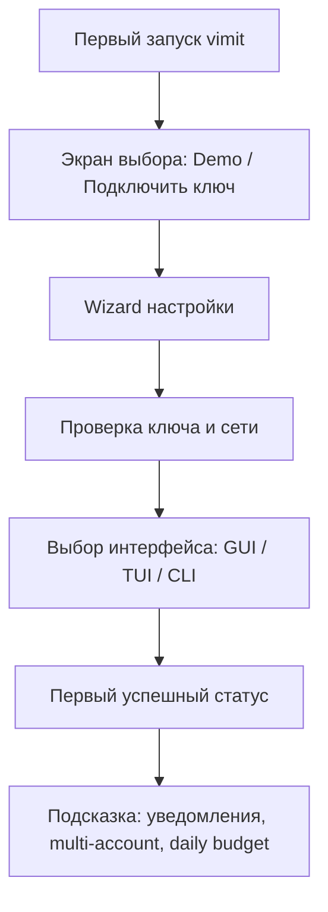

# Аналитический отчёт по функциям и болям пользователей проекта vimit

## Executive summary

`vimit` уже решает понятную и острую задачу: локально показывает расход квоты VibeMode по окнам 5h / 24h / 7d / 30d, умеет работать как CLI, TUI и опциональный GUI, поддерживает demo/mock, диагностику, интерактивную настройку, несколько аккаунтов, desktop-уведомления, тренды и автообновление. При этом продукт очень молод: публичные релизы выходили серией с 21 по 27 июня 2026 года, а в период между `v0.6.0` и `v0.6.1` проект даже переименовался из `neurogate-limit-watch` в `vimit`; в репозитории на момент анализа видно 15 issues, 0 открытых PR, 2 закрытых PR и одну discussion-тему с 0 комментариев. Это говорит о высокой скорости итераций, но и о незакрытом базовом UX-долге. citeturn41view0turn46view0turn46view1turn27view0turn45view0

Главная ценность проекта сегодня — не в нехватке функций, а в том, что текущие функции уже хороши, но местами не доведены до “безошибочного первого опыта”. Самые заметные проблемы: путаница в именах ключей и брендинге (`NEUROGATE_API_KEY` против `VIBEMODE_API_KEY`), неоднозначный путь к `.env` и конфигу для Windows-установки, слабая визуальная документация для новичка, недораскрытые возможности TUI, а также не до конца оформленная история приватности: проект заявляет local-first и “no telemetry”, но для пользователя это не собрано в единый понятный UX-слой доверия. citeturn36view0turn38view2turn14view1turn24view0turn38view5turn42view0

Если выбирать, что даст наибольший эффект в ближайшие недели, то приоритеты такие: сначала устранить несогласованность онбординга и документации, затем сделать “первый запуск без боли” для Windows/GUI, после этого усилить multi-account UX и видимость ключевых команд в TUI. Уже после этого имеет смысл инвестировать в более длинные темы: privacy center, IDE overlay/MCP и ресурсные guard-rail’ы для weak machines. Это даст рост не только удобства, но и доверия, а также снизит вероятность ложного отказа на самом первом запуске — критичная точка для молодой утилиты без широкой внешней воронки. citeturn43view0turn43view2turn18view0turn18view1turn26view1turn26view0

Коротко: у `vimit` уже есть сильный функциональный фундамент, но продукту нужен не “ещё один экран”, а выравнивание базового UX-контракта. Лучшие инвестиции сейчас — это консистентность, first-run flow, поясняющие состояния и прозрачность приватности. citeturn41view4turn36view1turn13view1turn14view0

## Исходные данные и текущее состояние продукта

В рамках анализа были просмотрены: русскоязычный README, ROADMAP, SECURITY/AUDIT, releases, discussion, issues, код CLI/TUI/GUI, а также сценарии `init`, `doctor`, `update` и Windows-скрипты установки/удаления. Отдельный `CHANGELOG.md` в просмотренных источниках не указан; фактическую историю изменений лучше считать по GitHub Releases. citeturn36view3turn36view2turn36view0turn36view1turn46view0turn45view0turn13view0turn13view1turn13view2turn24view0turn24view1

По сути продукта `vimit` — это нативная Rust-утилита для мониторинга квот VibeMode без Python/Node/SDK, с human/JSON/compact-выводом, полноэкранным ratatui-монитором, темами, оповещениями, multi-account, 30-дневными трендами и demo/mock режимами. В `Cargo.toml` продукт определён как “Safe VibeMode quota monitor for Codex/Droid workflows”, а релиз `v0.6.2` дополнительно подчёркивает single native binary, TUI-предустановки, пер-оконные пороги и Slint GUI. citeturn10view0turn41view0turn46view0

Сильная сторона проекта — уже сейчас есть три слоя интерфейса под разные сценарии: CLI для скриптов и CI, TUI для живого наблюдения, GUI для desktop-использования. В TUI есть `full/compact/mini`, спарклайны, темы и управление панелями; в GUI есть системный трей, скрытый режим, dropdown аккаунтов, ручная и авто-проверка обновлений, светлая/тёмная тема и панель настроек. В CLI есть интерактивный мастер `--init`, диагностика `--doctor`, а также self-update с кешированием проверки на 24 часа. citeturn41view4turn18view0turn18view1turn17view0turn13view0turn13view1turn13view2turn14view5

Но из этих же источников видно, что продукт ещё “сырой” именно как пользовательский путь. В ROADMAP и Discussion повторяются темы компактного виджета, Termux/Android, уведомлений, пер-оконных порогов и примеров реальных workflow. В issues отдельно поднимаются скриншоты README, автообнаружение ключей, self-update, дневной лимит, MCP, ресурсные ограничения и PII masking. Это хороший сигнал: команда уже интуитивно видит правильные направления, но часть из них пока существует как backlog, а не как завершённый пользовательский опыт. citeturn37view3turn45view0turn43view0turn43view2turn43view1turn25view0turn26view1turn26view0turn26view2

Самая важная находка анализа — консистентность ещё не доведена до продуктового стандарта. В `SECURITY.md` фигурирует `NEUROGATE_API_KEY`, в README примеры уже ведутся через `VIBEMODE_API_KEY`, а код `init` и `main` подсказывает именно `VIBEMODE_API_KEY`; при этом релизная история показывает недавнее переименование проекта. Для пользователя это выглядит как возможная “ложная ошибка настройки”, даже если сама логика кода в порядке. citeturn36view0turn38view2turn10view1turn14view1turn46view1

Ещё один критический UX-риск — Windows installer. PowerShell-скрипт создаёт `.env` в `%USERPROFILE%\.vimit\.env`, тогда как README объясняет поиск `.env` через `--env-file`, текущую директорию и папку рядом с бинарником; явного пользовательского описания чтения `%USERPROFILE%\.vimit\.env` в публичной документации нет. Это не обязательно логическая ошибка, но уже точно продуктовая неоднозначность, которая способна ломать “установил → запустил → не заработало”. citeturn24view0turn38view5

## Пользовательские персоны и реальные боли

Ниже — пять ключевых персон, которых сам проект уже частично адресует, и соответствующие точки фрустрации.

| Персона | Что уже покрыто | Главная боль | Почему это боль сейчас |
|---|---|---|---|
| **Novice Windows user** | demo, `--init`, `--doctor`, PowerShell install/uninstall, helper `.cmd`, GUI/трей | Первый запуск неоднозначен: где ключ, где `.env`, что запускать — `vimit.exe` или GUI, почему после двойного клика просто консоль | README просит CLI-команды и `.env` рядом с бинарником, installer пишет `.env` в другой путь, README пока без скриншотов, а issue на скриншоты помечен high priority. citeturn38view5turn24view0turn43view0 |
| **Developer / CLI user** | JSON/compact, TUI presets, `--fail-on`, thresholds, `--doctor`, trend storage | Мощность есть, но discoverability неполная: часть важных функций скрыта за клавишами и режимами | README отдельно объясняет, что надо нажать `5` для трендов, TUI по умолчанию держит `show_trends = false`, а AUDIT прямо отмечает недостаток help/discoverability в monitoring output. citeturn41view4turn33view2turn42view0turn42view4 |
| **Privacy-conscious user** | заявлены local-first, no telemetry, only `/v1/me`, stealth mode в GUI | Нет единого “центра доверия”: что именно уходит в сеть, что скрывает stealth, что попадает в notifications/JSON | README и SECURITY обещают высокий privacy baseline, но open issue про PII masking показывает, что расширенная модель приватности ещё не реализована; stealth mode пока скрывает суммы в GUI, а не всю информационную поверхность. citeturn36view0turn41view4turn17view0turn26view2 |
| **Multi-account user** | `accounts.toml`, Tab в TUI, dropdown в GUI | В TUI переключение аккаунтов линейное и слабо обозримое; нет быстрых сравнений аккаунтов | README обещает multi-account, GUI даёт dropdown, но TUI использует только последовательный `Tab`, а футер показывает лишь подсказку `Tab account`. citeturn38view4turn18view0turn31view0turn34view0 |
| **Power user / IDE overlay user** | compact output, tray/tooltip, TUI, идеи status-bar/widget, backlog MCP | Нет “always visible” слоя внутри IDE/overlays; проект всё ещё живёт как отдельное окно/терминал | В discussion и roadmap повторяются status bar / widget / Termux widget сценарии, а issue #12 описывает MCP-интеграцию как отсутствующую, но желанную. citeturn45view0turn37view3turn26view1 |

Из этих персон самая недообслуженная сегодня — **novice Windows user**. Не потому, что Windows не поддержан, а потому что именно здесь накладываются сразу четыре источника трения: CLI-центричная документация, отсутствие скриншотов, недавний rename-переход и спорная история с путями `.env`. Для молодой утилиты это главный барьер конверсии “скачал из релизов → остался пользоваться”. citeturn38view5turn43view0turn46view1turn24view0

Следом идёт **developer/CLI user**. Здесь проблема не в функциональном дефиците, а в “скрытой мощности”: продукт уже умеет много, но не всегда подсказывает это вовремя. Когда полезные функции включаются по клавишам, комментариям в README или по памяти, это работает для автора инструмента, но хуже работает для пользователя “после двух недель перерыва”. citeturn41view4turn33view2turn34view0turn42view0

## Рекомендации по функциям и UX-решениям

Ниже — приоритетный список улучшений. Приоритет и сложность — экспертная оценка по текущему коду, текущим backlog-сигналам и масштабу затронутых поверхностей.

| Рекомендация | Кого решает | UX-решение | Priority | Сложность | KPI |
|---|---|---|---|---|---|
| **Единый first-run onboarding для Windows и GUI** | novice Windows | При первом запуске показывать wizard: “Проверить demo → ввести ключ → протестировать соединение → выбрать режим интерфейса”. В GUI — стартовая страница вместо пустого/ошибочного состояния. Основание: уже есть `--init`, `--doctor`, GUI settings, update panel. citeturn13view0turn13view1turn18view0 | High | Medium | First successful setup rate, доля пользователей, дошедших до первого успешного `OK (4 window(s))`, снижение abandon rate после первого запуска |
| **Убрать naming/config debt** | novice Windows, developer | Полностью унифицировать `VIBEMODE_*` против `NEUROGATE_*`, пути `.env`, название проекта и текст ошибок. Добавить одну canonical-страницу “Где vimit ищет ключ”. Основание: README, SECURITY, release rename, installer path расходятся. citeturn36view0turn38view2turn24view0turn46view1 | High | Low | Снижение doctor-ошибок “key not found”, меньше GitHub issues по установке, рост доли успешных запусков без ручного чтения документации |
| **Скриншоты и “выбор интерфейса” в README/releases** | novice Windows, power user | Закрыть issue #22 и добавить в README блок “Что выбрать: CLI / TUI / GUI”. В release asset/README: 1 TUI screenshot, 1 GUI screenshot, 1 таблица “для кого что”. citeturn43view0turn41view3 | High | Low | CTR с README/release на первый запуск, снижение времени до первого полезного действия, меньше вопросов “а как это выглядит?” |
| **Страница ошибок и health center** | novice Windows, developer | Вместо сухих ошибок — error page с действиями: “Открыть `.env`”, “Запустить диагностику”, “Проверить сеть/API”, “Запустить demo”. Для CLI — короткий код ошибки + hint + команда-фикс. Основание: в коде уже есть error hints, `doctor` и `init`. citeturn10view1turn13view1turn14view0 | High | Medium | Успешный self-recovery rate, снижение повторных запусков с той же ошибкой, снижение issue rate на setup/network |
| **Account Hub и быстрый switcher** | multi-account | В GUI: mini summary по всем аккаунтам в dropdown. В TUI: popup по `a`/`Tab`, где видно alias + peak% + reset. Запоминать последний выбранный аккаунт. Основание: сейчас GUI лучше TUI по account UX. citeturn18view0turn31view0turn34view0 | High | Medium | Частота использования multi-account, снижение времени до переключения аккаунта, доля пользователей с 2+ аккаунтами, которые реально переключаются |
| **Повысить discoverability TUI** | developer, power user | Постоянная action-ribbon: `? help`, `5 trends`, `Tab account`, `p route`, `r refresh`. Пустые состояния должны подсказывать, что именно включить. Основание: тренды существуют, но скрыты; help есть, но видимость ограничена. citeturn33view2turn34view0turn42view0 | Medium | Low | Использование трендов, help open rate, retention у TUI-пользователей, снижение “feature invisibility” в пользовательских отзывах |
| **Daily budget planner** | developer, power user | Сделать “Сегодня” полноценным first-class объектом и в GUI, и в TUI: recommended/day, spent today, burn pace, прогноз “хватит ли до reset”. Основание: issue #21 уже формулирует почти готовый UX. citeturn25view0turn35view0 | High | Medium | Доля пользователей, настроивших daily limit, число дней без превышения weekly budget, engagement с daily card |
| **Privacy Center и полнофункциональный stealth** | privacy-conscious | Единая вкладка: “Что читает vimit”, “Что отправляет vimit”, “Что хранится локально”, “Что скрывает Stealth Mode”. Распространить stealth на notifications/tray/overlay. Если развивать proxy/MCP-направление — делать redaction как отдельный режим доверия, а не как второстепенную галочку. citeturn36view0turn41view4turn17view0turn26view2 | Medium | Medium | Включаемость stealth, снижение privacy-concern issues, trust score в опросе “понимаю, какие данные уходят” |
| **IDE overlay и MCP-интеграция** | power user / IDE overlay | Две ступени: сначала menubar/always-on-top mini overlay, затем `--mcp` для IDE discovery. Это даст “квота всегда перед глазами” без отдельного терминала. Основание: status-bar/widget ideas в discussion/roadmap и issue о MCP. citeturn45view0turn37view3turn26view1 | Medium | High | DAU overlay/MCP, среднее время открытия отдельного TUI/GUI, доля пользователей, использующих vimit внутри IDE workflow |
| **Ресурсные guard-rail’ы в watch/monitor** | novice Windows, power user | Degraded mode при перегрузе: увеличивать интервал, выключать тяжёлые панели, показывать badge “degraded”. Особенно важно для старых Windows-машин и IDE-heavy workflow. Основание: issue #13 довольно точно описывает нужный режим. citeturn26view0 | Medium | Medium | Средний CPU/RAM footprint, crash/freezing rate, session length в `--watch`/`--monitor` |

Текущий путь первого запуска логически уже существует, но он распределён по нескольким поверхностям — README, installer, `--init`, `--doctor`, ручные команды. Для novice-пользователя это нужно собрать в один UX-поток. citeturn38view2turn24view0turn13view1

Целевой поток должен быть короче и не требовать от пользователя знания внутренних терминов проекта.

## Риски, privacy и безопасность

С точки зрения позиции доверия у проекта хорошая база: в `SECURITY.md` и `README.ru.md` зафиксированы локальность, отсутствие телеметрии, работа с ключом через env и то, что в normal mode сетевой вызов сводится к `GET /v1/me`. AUDIT также повторяет, что JSON не должен включать account identity, а `--with-abtop` использует privacy-safe summaries. Это сильный фундамент для persona “privacy-conscious user”. citeturn36view0turn41view4turn42view0turn42view2

Но именно из-за сильных privacy-обещаний любая неоднозначность становится опаснее. Если продукт обещает “ключ не пишется на диск”, а пользователь одновременно видит installer, который создаёт конфиг сам, плюс разные имена env-переменных в документах, это снижает доверие — даже если реальной утечки нет. Здесь риск не столько технический, сколько продуктовый: пользователь перестаёт понимать модель безопасности. citeturn36view0turn24view0turn38view2

| Риск | Где проявляется | Последствие | Смягчение |
|---|---|---|---|
| **Путаница env-ключей и брендинга** | README / SECURITY / rename-история | Ошибки первого запуска, недоверие к документации | Один canonical namespace, migration-note в README/releases, doctor с явным указанием “ожидается именно этот ключ”. citeturn36view0turn38view2turn46view1 |
| **Неочевидный путь конфигурации в Windows** | installer vs README | “Установил, но не работает” | Привести installer и runtime search order к одному сценарию; в wizard показать реальный путь конфигурации. citeturn24view0turn38view5 |
| **Stealth Mode закрывает не все поверхности** | GUI/tray/notifications | Privacy gap при screen sharing | Сделать stealth глобальным режимом отображения, включая tray, popup и overlay. citeturn17view0turn41view4 |
| **Auto-discovery ключей может стать небезопасным по умолчанию** | issue #11 | Ложный выбор ключа, трудно объяснимая магия | Делать discovery opt-in или first-run only; всегда показывать, какой источник выбран, без вывода секрета. citeturn43view2 |
| **Развитие proxy/MCP без privacy-design** | issues #10, #12, #15 | Расширение поверхности риска раньше UX-доверия | Сначала Privacy Center, auditability и redaction policy; только затем глубокие интеграции. citeturn26view1turn26view2turn26view3 |
| **In-place self-update без понятного rollback UX** | `update.rs`, GUI updates | Страх обновления в корпоративной среде | Показать current → target version, changelog summary, ручной rollback/help link, checksum/status page. citeturn13view2turn18view1turn43view1 |

Практический вывод здесь такой: у `vimit` не проблема “безопасность не продумана”; наоборот, она продумана лучше среднего для маленькой утилиты. Проблема в том, что этот security story пока недостаточно хорошо упакован для обычного пользователя. citeturn36view0turn42view0turn42view1

## Метрики успеха и roadmap

Чтобы не распыляться, я бы измерял успех не “по числу фич”, а по трём воронкам: **успешный первый запуск**, **переход в регулярное использование**, **доверие и предсказуемость**. Для этого достаточно простых KPI, которые можно собирать даже без телеметрии: через opt-in crash/error report, ручные опросы, GitHub issue labels, и локальные события в явном debug/export-режиме. Если телеметрия принципиально не используется, это должно быть прямо отражено: часть KPI придётся измерять “беднее”, но честно. citeturn36view0turn42view0

### Быстрые wins

| Горизонт | Что делать | Почему это быстро |
|---|---|---|
| **1–2 дня** | Закрыть naming debt: README, SECURITY, doctor example, error copy, release notes | Изменения в текстах и хинтах, без тяжёлой архитектуры. citeturn36view0turn38view2turn10view1 |
| **1–2 дня** | Закрыть issue со скриншотами и вставить “CLI / TUI / GUI — что выбрать” | Уже сформулировано как отдельный high-priority issue. citeturn43view0 |
| **2–3 дня** | Исправить Windows install path contract | Нужно синхронизировать install script и docs. citeturn24view0turn38view5 |
| **2–4 дня** | Добавить TUI ribbon и пустые состояния для трендов/help/account | Поверхностное изменение TUI, без смены модели данных. citeturn33view2turn34view0 |
| **3–5 дней** | GUI first-run error page с кнопками “Demo / Test connection / Open config / Doctor” | Логика уже есть в `init`, `doctor`, update/settings. citeturn13view0turn13view1turn18view0 |
| **4–7 дней** | Daily budget planner в TUI/JSON и затем в GUI | Issue #21 уже содержит хорошую спецификацию. citeturn25view0turn35view0 |

### Долгосрочные функции

| Горизонт | Что делать | Ожидаемый эффект |
|---|---|---|
| **До 3 месяцев** | Account Hub и быстрый switcher | Сильный рост удобства для heavy users и команд с несколькими ключами |
| **До 3 месяцев** | Privacy Center и глобальный stealth | Рост доверия и лучшее позиционирование local-first |
| **До 3 месяцев** | Overlay/menubar mini mode | Уменьшение необходимости держать отдельный терминал |
| **До 3 месяцев** | MCP/IDE integration | Выход в power-user сценарии Cursor/Codex/Windsurf |
| **До 3 месяцев** | Resource self-throttle/degraded mode | Стабильность на слабых машинах и в `--watch`/`--monitor` |

### Роадмап на 7 дней

| День | Фокус | Результат |
|---|---|---|
| **День 1** | Аудит терминов и env names | Один canonical namespace во всех docs и errors |
| **День 2** | README/release UX | Скриншоты, matrix “какой интерфейс выбрать”, блок first-run |
| **День 3** | Windows install contract | Installer кладёт конфиг туда, где приложение его реально ожидает, либо создаёт `config.toml` с `env_file` |
| **День 4** | TUI discoverability | Нижняя ribbon, CTA для трендов, явная account/help подсказка |
| **День 5** | GUI first-run health page | Самоисцеление без похода в README |
| **День 6** | Daily budget planner v1 | “Сегодня” в TUI/JSON |
| **День 7** | Финальная полировка | Smoke test Windows/Linux/macOS, обновление release notes |

### Роадмап на 3 месяца

| Месяц | Фокус | Выход |
|---|---|---|
| **Первый месяц** | Онбординг, аккаунты, TUI/GUI consistency | “Первый запуск без боли”, multi-account UX v2 |
| **Второй месяц** | Privacy и устойчивость | Privacy Center, глобальный stealth, resource guard |
| **Третий месяц** | Power-user expansion | Overlay/menubar, MCP beta, IDE-oriented workflows |

Итоговая ставка простая: **сначала снять friction в базовом UX, потом наращивать advanced-функции**. Для `vimit` это особенно важно, потому что core value уже доказан кодом и релизами; сейчас выигрывает не тот backlog, который “самый технологичный”, а тот, который сильнее всего повышает вероятность, что пользователь дойдёт до полезного статуса лимитов за первые 3–5 минут. citeturn46view0turn13view1turn41view4turn42view1